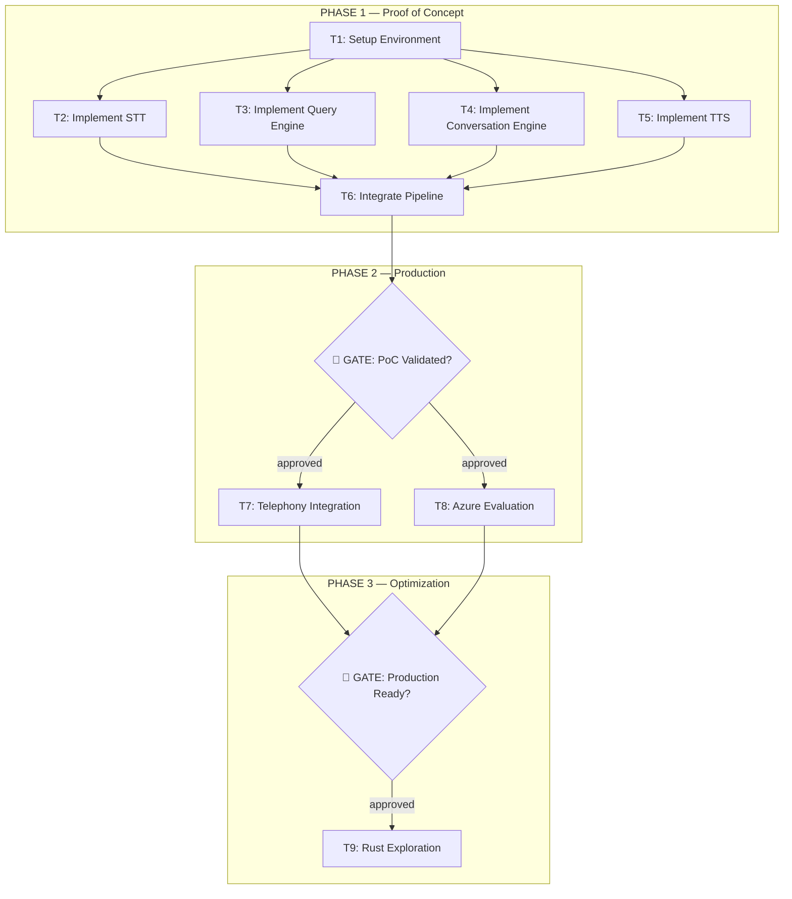

# AI-Native PRD — Sureline Voice Agent

```
PRD
 ├── System Context
 ├── Capabilities
 ├── Constraints
 └── Interfaces

Execution Layer
 ├── Task Graph
 ├── Agent Instructions
 └── Failure Recovery

Validation Layer
 ├── Acceptance Tests
 ├── Self-Verification
 └── Observability
```

---

## 1. System Context

```yaml
product_name: Sureline — Enterprise Voice Agent
version: 0.1

objective:
  Build a real-time voice agent that accepts client speech over phone
  or web, queries company databases and Excel files using SQL or Pandas,
  and returns a natural-sounding spoken answer — all within a streaming
  pipeline powered by the Pipecat framework.

primary_user:
  Enterprise clients who need instant, conversational answers from
  internal company data (databases, spreadsheets, documents).

secondary_user:
  Internal developers and DevOps maintaining the voice agent pipeline.

environment:
  hardware: CPU primary (GPU optional for acceleration)
  runtime: Python 3.10+
  framework: Pipecat (streaming audio orchestration)
  deployment: Local / on-premise server
  optional_language: Rust (for latency-critical backend components)

stt_provider_options:
  primary: Sarvam AI (saaras:v3, streaming WebSocket via Pipecat SarvamSTTService)
  future_phase_2: Azure Speech Services (company Azure subscription — evaluate for cost)

tts_provider_options:
  primary: Sarvam AI (bulbul:v3, streaming WebSocket via Pipecat SarvamTTSService)
  backup: ElevenLabs (toggle via TTS_PROVIDER=elevenlabs in .env — key already configured)
  future_phase_2: Azure TTS (company Azure subscription — evaluate for cost)
  toggle_mechanism: TTS_PROVIDER env var ("sarvam" | "elevenlabs")

telephony_provider_options:
  - Plivo
  - Exotel
  fixed_cost: ~₹250–300/month for a rented number

success_metrics:
  end_to_end_latency: < 2 seconds
  stt_accuracy: > 92% (word-error rate < 8%)
  query_success_rate: > 85%
  crash_rate: < 1%
  cost_per_interaction: < ₹1
  system_uptime: > 99%
```

---

## 2. Capabilities

```yaml
capabilities:

  speech_to_text:
    description: >
      Convert incoming client audio to text in real time via streaming
      STT (AssemblyAI, Groq Whisper, or Azure Speech Services).
    priority: high

  natural_language_data_querying:
    description: >
      Translate the transcribed question into a SQL query or Python
      Pandas operation against company databases, Excel files, or CSVs,
      and execute it to retrieve results.
    priority: high

  conversation_engine:
    description: >
      Generate a contextual, concise, speech-friendly answer from query
      results using a local or API LLM with vector-DB RAG context.
    priority: high

  text_to_speech:
    description: >
      Convert the response text to natural-sounding speech audio via
      ElevenLabs or Azure TTS, streamed back to the client.
    priority: high

  streaming_and_barge_in:
    description: >
      Use the Pipecat framework to stream audio/text through the full
      pipeline and allow the user to interrupt (barge-in) the agent
      mid-response.
    priority: high

  telephony_integration:
    description: >
      Connect the voice pipeline to a rented phone number via Plivo
      or Exotel so clients can call in.
    priority: medium

  session_memory:
    description: >
      Maintain conversation history within a call for multi-turn
      question-and-answer interactions.
    priority: medium

  azure_service_integration:
    description: >
      Evaluate and integrate Azure Speech Services (STT/TTS) using
      the company's existing Azure subscription to reduce external
      API costs.
    priority: medium

  rust_backend_exploration:
    description: >
      Investigate using Rust for latency-critical portions of the
      agentic backend, inspired by Perplexity's voice-agent
      architecture.
    priority: low
```

---

## 3. Interfaces

```yaml
interfaces:

  stt_service:
    transport: Streaming WebSocket / REST
    input:
      audio: PCM chunks (16 kHz, mono)
    output:
      transcript: string
      is_final: boolean

  query_engine:
    transport: Internal function call
    input:
      question: string
      schema_metadata: object
    output:
      result: array | object
      generated_query: string (SQL or Pandas code)
      success: boolean

  llm_service:
    transport: Internal function call or API
    input:
      query_result: object
      conversation_history: array
    output:
      response: string

  tts_service:
    transport: Streaming WebSocket / REST
    input:
      text: string
      voice_id: string
    output:
      audio: streaming PCM chunks

  telephony_bridge:
    transport: SIP / WebSocket
    input:
      inbound_call: audio stream (G.711 / PCM)
    output:
      outbound_audio: audio stream (G.711 / PCM)

  data_source:
    transport: SQL connection / file read
    input:
      connection_string: string
      query: string (SQL) | code: string (Pandas)
    output:
      rows: array of objects
```

---

## 4. Constraints

```yaml
constraints:

  compute:
    gpu: optional
    cpu: yes (must work on CPU-only hardware)

  latency:
    total_pipeline: < 2 seconds end-to-end
    stt: < 500 ms
    llm_inference: < 800 ms
    tts_ttfb: < 300 ms

  cost:
    fixed_monthly: ~₹250–300 (telephony number rental)
    variable: pay-as-you-go only; prefer Azure (included in company subscription)
    target_per_interaction: < ₹1

  data_security:
    company_data: must remain local / on-premise
    external_api_data: only anonymised text sent to STT/TTS/LLM providers

  framework:
    orchestration: Pipecat
    primary_language: Python 3.10+
    optional_language: Rust (for performance-critical paths)

  model_size:
    stt_model: < 2 GB (if using local model)
    vector_db: ChromaDB or FAISS (local)
```

---

## 5. Task Graph (Agent Execution Plan)

```yaml
tasks:

  - id: T1
    name: setup_environment
    dependencies: []

    steps:
      - Create project directory structure
      - Set up Python 3.10+ virtual environment
      - Install Pipecat framework and base dependencies
      - Configure .env with API keys (STT, TTS, LLM)
      - Set up local vector DB (ChromaDB / FAISS)

    output:
      environment_ready: true
      files: [requirements.txt, .env, project structure]

  - id: T2
    name: implement_stt
    dependencies: [T1]

    steps:
      - Integrate Sarvam AI streaming STT via Pipecat SarvamSTTService
      - Use model saaras:v3 (22 Indian languages + English, code-mixing support)
      - Write stt_module.py with create_stt_service() factory returning Pipecat service
      - Configure SarvamSTTService.Settings(model, mode="transcribe", vad_signals=False)
      - Use Pipecat local Silero VAD for turn-boundary detection
      - Test with sample speech and verify TranscriptionFrame output
      - Note: ensure sarvamai>=0.1.25 in requirements (pipecat extra may pin older version)

    output:
      stt_module.py

    validation:
      - Transcription of test speech returns correct text
      - WER < 8%
      - Latency < 500 ms

  - id: T3
    name: implement_query_engine
    dependencies: [T1]

    steps:
      - Load database schema and Excel/CSV metadata
      - Build LLM prompt template with schema context
      - Implement NL → SQL / Pandas code generation
      - Execute generated queries in sandboxed environment
      - Return structured results

    output:
      query_engine.py

    validation:
      - 5 sample questions return correct results
      - All queries are read-only
      - Execution timeout at 5 seconds

  - id: T4
    name: implement_conversation_engine
    dependencies: [T1]

    steps:
      - Set up vector DB with company document embeddings
      - Implement RAG retrieval for context augmentation
      - Build LLM response generation with query results + history
      - Format responses for spoken output (concise, natural)

    output:
      conversation_engine.py

    validation:
      - Accurate, concise answers for 5 test queries
      - Responses suitable for speech (1–3 sentences)
      - LLM inference < 800 ms

  - id: T5
    name: implement_tts
    dependencies: [T1]

    steps:
      - Integrate Sarvam AI streaming TTS as primary via Pipecat SarvamTTSService
      - Use model bulbul:v3, voice "shubh" (24kHz, adds temperature control)
      - Retain ElevenLabs as backup provider (key already in .env)
      - Implement toggle: TTS_PROVIDER=sarvam|elevenlabs in .env
      - Write tts_module.py with create_tts_service() factory (toggle-aware)
      - Test with sample text through both providers

    output:
      tts_module.py

    validation:
      - Sarvam TTS: audio plays correctly with natural Indian-English prosody
      - ElevenLabs: audio plays when TTS_PROVIDER=elevenlabs is set
      - TTFB < 300 ms for active provider

  - id: T6
    name: integrate_pipeline
    dependencies: [T2, T3, T4, T5]

    steps:
      - Wire Pipecat pipeline: transport.input() → SarvamSTT → SurelineContextProcessor
          → OllamaLLM → SarvamTTS → transport.output()
      - SurelineContextProcessor intercepts TranscriptionFrame, runs RAG + SQL,
          builds enriched LLMMessagesFrame before passing to LLM
      - Enable barge-in via PipelineParams(allow_interruptions=True) + Silero VAD
      - Add session memory for multi-turn conversations (in ConversationEngine)
      - Provide --text-mode flag in pipeline.py for no-audio dev/test
      - Run end-to-end tests with real voice

    output:
      pipeline.py

    validation:
      - Spoken data question → correct spoken answer
      - Latency < 2 seconds
      - Barge-in works within 300 ms
      - --text-mode pipeline works without audio hardware

  - id: T6_5
    name: voice_animation_ui
    phase: phase_1_poc
    dependencies: [T6]

    steps:
      - Build audio-reactive Indian mandala orb animation (HTML/CSS/JS)
      - Dark indigo/charcoal background (#0b0b0f / #1a1620)
      - SVG alpona / mandala line art overlay (chalk-white, opacity 0.05–0.12)
      - Muted gold micro-accents (#c9a96a)
      - Canvas waveform ring that expands with Web Audio API amplitude
      - States: idle (slow breathe) | listening (ring pulses) | speaking (full bloom)
      - Web Audio API AnalyserNode → FFT → canvas animation loop
      - Connect speaking state to WebSocket/VAD events from Pipecat pipeline
      - Reference: Voice-animation.md + ChatGPT Image Apr 4, 2026 reference image

    output:
      frontend/index.html, frontend/voice_orb.js, frontend/style.css

    validation:
      - Animation visible in browser
      - Orb reacts to microphone amplitude in real time
      - Smooth 60fps on a mid-range CPU
      - Visual style matches Indian lotus mandala reference

  - id: T7
    name: telephony_integration
    phase: phase_2_production
    dependencies: [T6, GATE_POC]
    blocked_until: GATE_POC approved

    steps:
      - Sign up for Plivo / Exotel account
      - Rent a phone number (~₹250–300/month)
      - Configure SIP/WebSocket bridge to Pipecat pipeline
      - Test inbound call → pipeline → spoken response

    output:
      telephony_config.py

    validation:
      - Successful phone call with correct spoken answer
      - Call connects within 3 seconds
      - Audio quality is clear

  - id: T8
    name: azure_evaluation
    phase: phase_2_production
    dependencies: [T2, T5, GATE_POC]
    blocked_until: GATE_POC approved

    note: >
      Azure Speech Services (STT + TTS) will be evaluated in Phase 2 using
      the company's existing Azure subscription as a potential cost-saving
      alternative to Sarvam + ElevenLabs. Do NOT implement until PoC is
      validated and GATE_POC is approved.

    steps:
      - Set up Azure Speech Services (STT + TTS) on company Azure subscription
      - Add AzureSTTService and AzureTTSService as new options in stt_module.py / tts_module.py
      - Run identical test suite used for Sarvam
      - Benchmark latency, accuracy, and cost vs Sarvam
      - Generate comparison report

    output:
      azure_benchmark_report.md

    validation:
      - Comparison table: Sarvam vs Azure (latency, accuracy, cost per minute)
      - Clear recommendation on whether to switch or keep hybrid

  - id: T9
    name: rust_backend_exploration
    phase: phase_3_optimization
    dependencies: [T6, GATE_PRODUCTION]
    blocked_until: GATE_PRODUCTION approved
    priority: stretch

    steps:
      - Research Perplexity's voice-agent architecture publication
      - Profile Python pipeline to identify bottlenecks
      - Prototype one bottleneck module in Rust
      - Benchmark Rust vs Python performance

    output:
      rust_feasibility_report.md

    validation:
      - Rust module produces equivalent output
      - Measurable latency improvement documented
```

### Task Dependency Graph



---

### 5.1 Execution Phases

```yaml
phases:

  phase_1_poc:
    name: Proof of Concept
    goal: >
      Prove the core voice-agent pipeline works end-to-end locally
      WITHOUT any paid recurring infrastructure (no telephony).
    tasks: [T1, T2, T3, T4, T5, T6, T6_5]
    milestone:
      - End-to-end pipeline runs locally (mic/speaker or test audio)
      - Spoken question → correct spoken answer within 2 seconds
      - Barge-in works
      - Voice animation UI renders and reacts to audio
      - No recurring costs incurred
    gate: GATE_POC
    gate_criteria:
      - All Phase 1 tasks pass validation
      - At least 5 diverse test questions answered correctly
      - Latency consistently < 2 seconds
    gate_action: >
      STOP execution. Report PoC results to the owner.
      Do NOT proceed to Phase 2 until the owner explicitly approves.

  phase_2_production:
    name: Production Readiness
    goal: >
      Add telephony integration and evaluate Azure as a cost-saving
      provider swap. This phase involves recurring costs (phone number
      rental), so it is only started after PoC is validated.
    tasks: [T7, T8]
    requires: GATE_POC == approved
    milestone:
      - Clients can call a real phone number and get answers
      - Azure vs external provider comparison complete
    gate: GATE_PRODUCTION
    gate_criteria:
      - Telephony call works end-to-end
      - Azure benchmark report generated
    gate_action: >
      STOP execution. Report production results to the owner.
      Do NOT proceed to Phase 3 until the owner explicitly approves.

  phase_3_optimization:
    name: Performance Optimization
    goal: >
      Explore Rust for latency-critical backend paths. This is a
      stretch goal that only makes sense once the system is live.
    tasks: [T9]
    requires: GATE_PRODUCTION == approved
    milestone:
      - Rust feasibility report with benchmarks
```

---

## 6. Agent Execution Instructions

```yaml
agent_instructions:

  execution_strategy:
    - Read this PRD fully before starting any work
    - Construct dependency graph from Task Graph (§5)
    - Identify the current phase from Execution Phases (§5.1)
    - Execute ONLY tasks belonging to the current phase
    - Execute tasks in topological order within the phase
      (T1 first, then T2–T5 in parallel, then T6)
    - Run validation checks after each task
    - Update task status in task tracker
    - Do not proceed to dependent tasks until all prerequisites pass validation
    - When a phase gate is reached, STOP and report results
    - Do NOT cross a phase gate without explicit owner approval

  phase_gate_protocol:
    on_gate_reached:
      - Log all task validation results for the completed phase
      - Generate a summary report (pass/fail, latency numbers, cost)
      - Present report to the owner
      - HALT execution and wait for approval
    on_gate_approved:
      - Log approval and proceed to next phase
    on_gate_rejected:
      - Log rejection reason
      - Return to failed tasks and retry or request guidance

  failure_handling:
    retry_limit: 3
    backoff: exponential (1s, 2s, 4s)
    fallback_strategy:
      stt_failure:
        - Log error and retry Sarvam STT (up to retry_limit)
        - If Sarvam unreachable, fall back to mock STT (text input) for continued testing
        - Azure STT available in Phase 2 as long-term fallback option
      tts_failure:
        - If Sarvam TTS fails, automatically try ElevenLabs (key already in .env)
        - Toggle via TTS_PROVIDER=elevenlabs in .env to force ElevenLabs
        - Azure TTS available in Phase 2 as additional fallback
      llm_failure:
        - Try smaller model
        - Reduce context window
      query_failure:
        - Return "I couldn't find that data" instead of crashing

  logging:
    required: true
    level: INFO (DEBUG for development)
    format: structured JSON

  cost_awareness:
    - Always prefer Azure services if company subscription is available
    - Track cost per API call
    - Alert if cost per interaction exceeds ₹2
    - Do NOT incur any recurring costs (e.g. telephony rental) during Phase 1
```

---

## 7. Self-Verification

```yaml
self_verification:

  after_task_completion:
    - Run unit tests for the completed module
    - Check that all output files exist and are non-empty
    - Confirm module imports succeed without errors
    - Verify latency targets are met for the module
    - Log verification results

  after_pipeline_integration:
    - Run end-to-end test with 5 diverse spoken questions
    - Verify barge-in actually interrupts TTS
    - Confirm session memory retains context across turns
    - Measure and log end-to-end latency

  validation_commands:
    - pytest tests/ -v
    - python -m py_compile <module>.py
    - python pipeline.py --test-mode

  regression_check:
    - Re-run all previous tests after each new task completion
    - Ensure no module breaks when integrated
```

---

## 8. Acceptance Tests

```yaml
tests:

  - id: test_stt
    description: Speech-to-text accuracy
    input: test_audio.wav ("What were our total sales last quarter?")
    expected_output: Transcript with WER < 8%
    latency_target: < 500 ms

  - id: test_query_generation
    description: Natural language to SQL/Pandas
    input: "What were our total sales last quarter?"
    expected_output: Valid SQL or Pandas code that returns correct sum
    validation: Query result matches known answer

  - id: test_llm_response
    description: LLM generates spoken-friendly answer
    input: query_result = { "total_sales": 4200000 }
    expected_output: "Total sales last quarter were ₹42 lakh." (or equivalent)
    validation: Factual, concise, suitable for speech

  - id: test_tts
    description: Text-to-speech quality
    input: "Total sales last quarter were 42 lakh rupees."
    expected_output: Clear, natural-sounding audio
    latency_target: TTFB < 300 ms

  - id: test_pipeline_e2e
    description: Full end-to-end pipeline
    input: Spoken question about company data
    expected_output: Correct spoken answer
    latency_target: < 2 seconds

  - id: test_barge_in
    description: User interruption handling
    input: User speaks while agent is responding
    expected_output: Agent stops speaking, processes new input
    latency_target: Interruption detected within 300 ms

  - id: test_no_results
    description: Graceful handling of empty results
    input: "What were our sales in Antarctica?"
    expected_output: "I couldn't find any data matching that question."

  - id: test_telephony
    description: Phone call integration
    input: Inbound phone call with spoken question
    expected_output: Correct spoken answer delivered over phone
    validation: Call connects within 3 seconds, audio is clear
```

---

## 9. Observability

```yaml
observability:

  logs:
    - pipeline_start
    - pipeline_end
    - stt_request_sent
    - stt_transcript_received
    - query_generated
    - query_executed
    - query_result_received
    - llm_prompt_sent
    - llm_response_received
    - tts_request_sent
    - tts_audio_streamed
    - barge_in_detected
    - error_occurred
    - retry_attempted

  metrics:
    - end_to_end_latency (p50, p95, p99)
    - stt_latency
    - query_execution_latency
    - llm_inference_latency
    - tts_time_to_first_byte
    - stt_word_error_rate
    - query_success_rate
    - error_rate_by_component
    - cost_per_interaction
    - active_sessions

  alerts:
    - error_rate > 5% over 5-minute window
    - p95_latency > 3 seconds
    - stt_provider_unreachable > 30 seconds
    - cost_per_interaction > ₹2
```

---

## 10. Definition of Done

```yaml
definition_of_done:

  phase_1_poc_done:
    - Tasks T1–T6 and T6_5 completed and validated
    - Acceptance tests test_stt, test_query_generation, test_llm_response,
      test_tts, test_pipeline_e2e, test_barge_in, test_no_results all pass
    - STT via Sarvam saaras:v3, TTS via Sarvam bulbul:v3 (ElevenLabs backup tested)
    - End-to-end latency consistently < 2 seconds
    - Barge-in / user interruption fully functional
    - Session memory retains context within a call
    - Voice animation UI renders, reacts to audio, matches Indian mandala aesthetic
    - No recurring costs incurred
    - Owner has reviewed and approved GATE_POC

  phase_2_production_done:
    - Tasks T7 and T8 completed and validated
    - test_telephony passes
    - Telephony integration working with live phone number
    - Azure evaluation report complete with clear recommendation
    - Cost per interaction confirmed < ₹1
    - Observability (logs, metrics, alerts) operational
    - Documentation generated for setup, configuration, and usage
    - Owner has reviewed and approved GATE_PRODUCTION

  phase_3_optimization_done:
    - Task T9 completed
    - Rust feasibility report with benchmarks generated
    - System runs end-to-end without manual intervention
```
